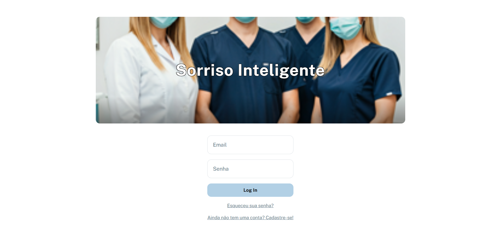
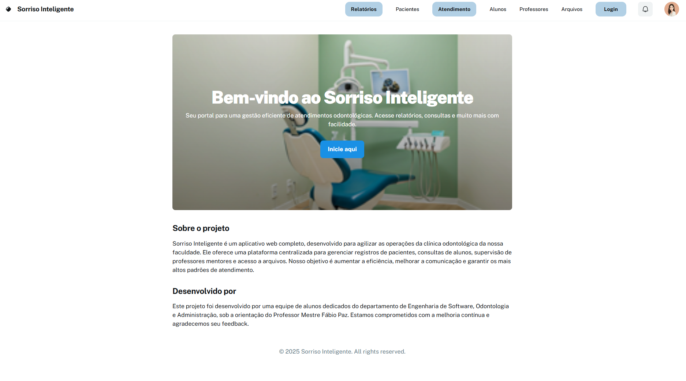
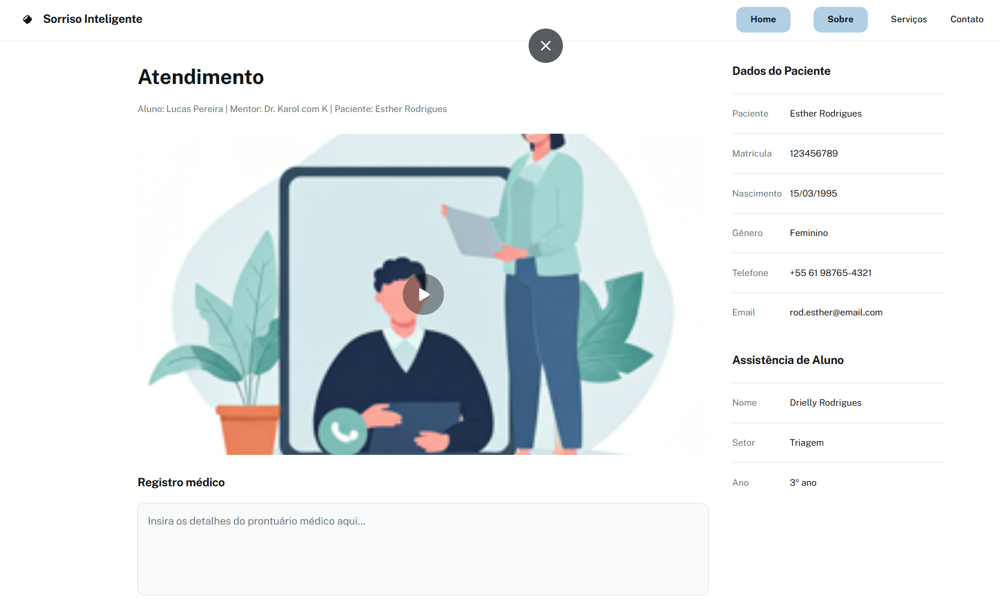
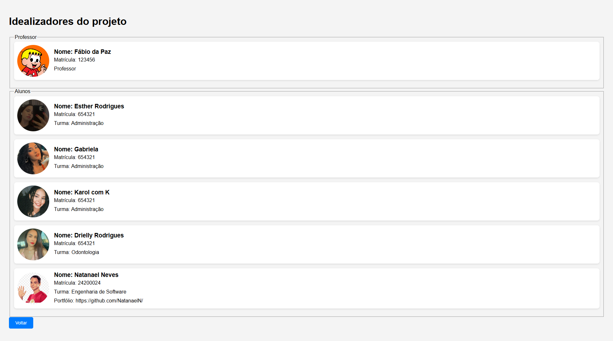
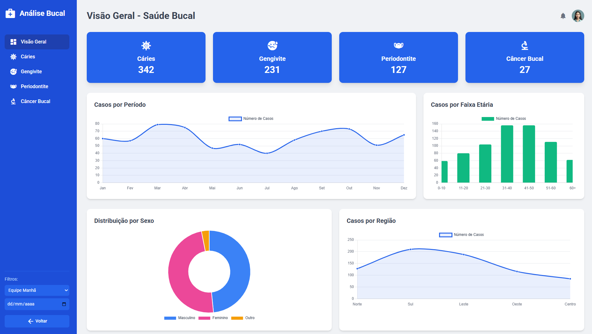

# 😁 Sorriso Inteligente

**Sorriso Inteligente** é um aplicativo web completo, desenvolvido para agilizar as operações da clínica odontológica da nossa faculdade. Ele oferece uma plataforma centralizada para:  

- ✅ Gerenciar registros de pacientes  
- ✅ Consultas de alunos  
- ✅ Supervisão de professores mentores  
- ✅ Acesso facilitado a arquivos  

Nosso objetivo é aumentar a eficiência, melhorar a comunicação e garantir os mais altos padrões de atendimento.  

Este projeto foi desenvolvido por uma equipe de alunos dedicados dos departamentos de **Engenharia de Software**, **Odontologia** e **Administração**, sob a orientação do **Professor Mestre Fábio Paz**.  

> ⚠️ **Nota:** Este é um projeto **puramente acadêmico** e **não pode ser comercializado**.

---

## 🚀 Tecnologias Utilizadas

- 🧱 **HTML** e **CSS** puro na maior parte do projeto  
- 🎨 Uso pontual de **Tailwind CSS** para estilização rápida  
- 🧑‍💻 **JavaScript** na página de relatórios para interatividade adicional  

---

## 📸 Capturas de Tela

Aqui estão algumas capturas de tela demonstrando as principais funcionalidades do sistema:  

### 🔐 Tela de Login  

---

### 🏠 Tela Inicial  

---

### 🦷 Tela de Atendimento  

---

### 👥 Tela Patrono (Relação dos Alunos Envolvidos)  

---

### 📊 Tela Relatório  

.png)
.png)
.png)
.png)

---

## 🛠️ Implementações Futuras

- 🔗 Conexão com um **banco de dados** para armazenamento persistente dos registros  
- 🧠 Inclusão de **inteligência artificial** para análise preditiva dos dados odontológicos  
- 👥 Integração com **profissionais da comunidade**, permitindo que **ex-alunos** contribuam ativamente com o projeto e com a clínica  

---

## 🤝 Agradecimentos

Agradecemos ao **Professor Mestre Fábio Paz** pela orientação e apoio para o desenvolvimento deste projeto.  

Também parabenizamos toda a equipe envolvida pelo comprometimento e dedicação.  

---

## 📢 Feedback

Estamos comprometidos com a **melhoria contínua**!  
Sugestões ou feedbacks são **muito bem-vindos**.  

---

## ⚠️ Aviso Legal

Este é um **projeto acadêmico** desenvolvido para fins de aprendizado e melhoria de processos internos. **Não deve ser utilizado para fins comerciais.**

---

## ✨ Frase de Efeito

> **"Transformando sorrisos com tecnologia, porque até um sistema bem feito é capaz de abrir um sorriso!"** 😁💻🦷

---

